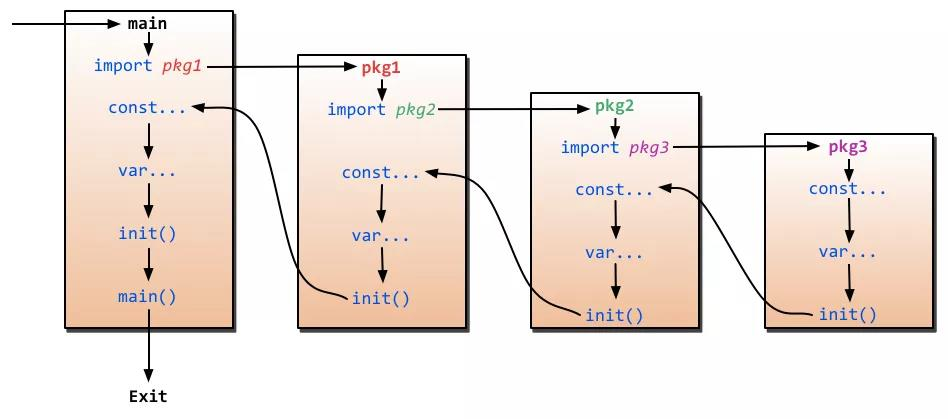

## new() 与 make() 的区别

参考答案：

new(T) 和 make(T,args) 是 Go 语言内建函数，用来分配内存，但适用的类型不同。

new(T) 会为 T 类型的新值分配已置零的内存空间，并返回地址（指针），即类型为 `*T`的值。换句话说就是，返回一个指针，该指针指向新分配的、类型为 T 的零值。适用于值类型，如数组、结构体等。

make(T,args) 返回初始化之后的 T 类型的值，这个值并不是 T 类型的零值，也不是指针 `*T`，是经过初始化之后的 T 的引用。make() 只适用于 slice、map 和 channel.

## 结构体的能否比较

- 结构体只能比较是否相等，但是不能比较大小。
- 相同类型的结构体才能够进行比较，`结构体是否相同不但与属性类型有关，还与属性顺序相关`

- 如果 struct 的所有成员都可以比较，则该 struct 就可以通过 == 或 != 进行比较是否相等，比较时逐个项进行比较，如果每一项都相等，则两个结构体才相等，否则不相等；

那什么是可比较的呢，常见的有 bool、数值型、字符、指针、数组等，像切片、map、函数等是不能比较的。 具体可以参考 Go 说明文档。https://golang.org/ref/spec#Comparison_operators

## 关于 init() 函数有几个需要注意的地方：

- init() 函数是用于程序执行前做包的初始化的函数，比如初始化包里的变量等;
-  一个包可以出现多个 init() 函数,一个源文件也可以包含多个 init() 函数；
- 同一个包中多个 init() 函数的执行顺序没有明确定义（跟代码书写的位置有关 先出现的先执行），但是不同包的init函数是根据包导入的依赖关系决定的（看下图）;
- init() 函数在代码中不能被显示调用、不能被引用（赋值给函数变量），否则出现编译错误;
- 一个包被引用多次，如 A import B,C import B,A import C，B 被引用多次，但 B 包只会初始化一次；
- 引入包，不可出现死循坏。即 A import B,B import A，这种情况编译失败；

