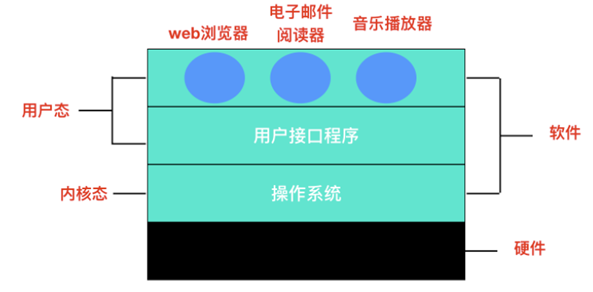
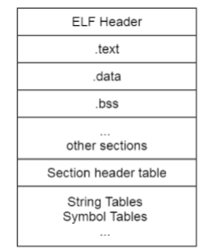
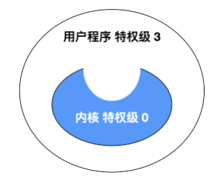
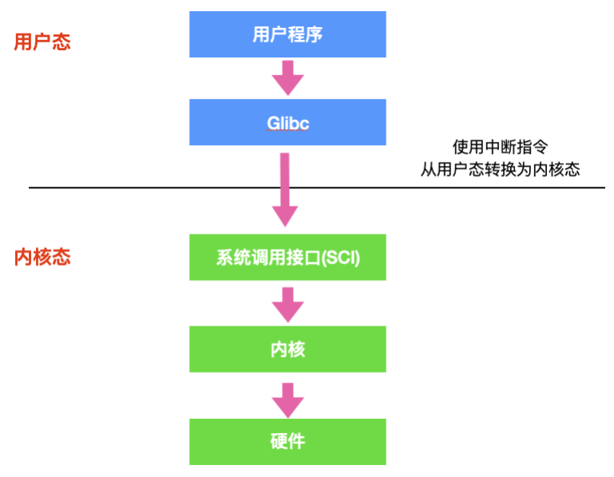
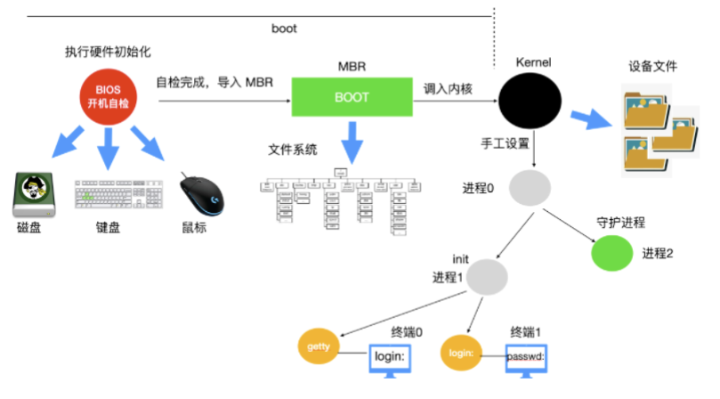
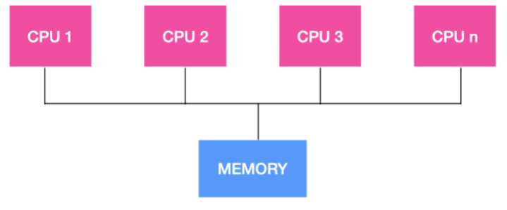
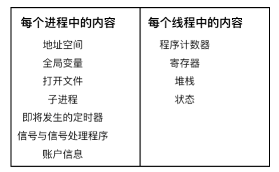
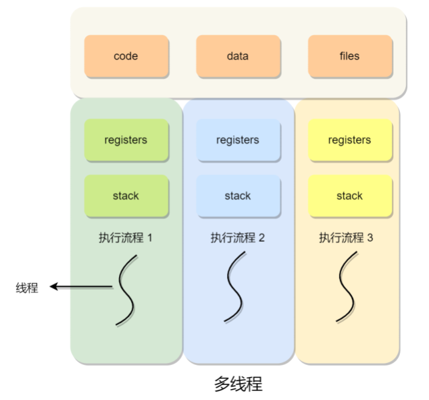
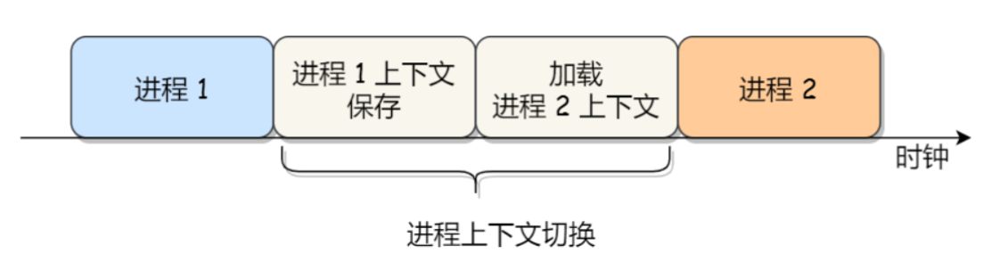
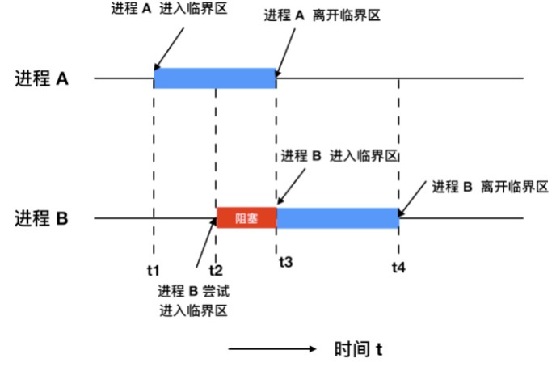

go面试宝典(第一版)                

面试题来源说明： 

1. 网上分享的真实面试经历，将其中的面试题整理出来，并附上详尽答案 
2. 本人多年面试经验，常用的面试题整理，并附上详尽答案 
3. 网上分享的go相关面试题整理，并附上详尽答案 

特色： 

- 面试真题
- 答案详尽 
- 分类整理 

# 1.操作系统

## 

## 1.1解释一下什么是操作系统

`操作系统是管理硬件和软件的一种应用程序。`操作系统是运行在计算机上最重要的一种软件，它管理计算机的资源和进程以及所有的硬件和软件。它为计算机硬件 

和软件提供了一种中间层，使应用软件和硬件进行分离，让我们无需关注硬件的实现，把关注点更多放在软件应用上。

通常情况下，计算机上会运行着许多应用程序，它们都需要对`内存`和`CPU`进行交互，操作系统的目的就是为了保证这些访问和交互能够准确无误的进行。

## 1.2 操作系统主要有哪些功能？ 

**一般来说，现代操作系统主要提供下面几种功能**

> - 进程管理 : 进程管理的主要作用就是任务调度，在单核处理器下，操作系统会为每个进程分配一个任务，进程管理的工作十分简单；而在多核处理器下，操作系统除了要为进程分配任务外，还要解决处理器的调度、分配和回收等问题
>
> - 内存管理 ：内存管理主要是操作系统负责管理内存的分配、回收，在进程需要时分配内存以及在进程完成时回收内存，协调内存资源，通过合理的页面置换算法进行页面的换入换出
>
> - 设备管理 ：根据确定的设备分配原则对设备进行分配，使设备与主机能够并行工作，为用户提供良好的设备使用界面。
>
> - 文件管理 ：有效地管理文件的存储空间，合理地组织和管理文件系统，为文件访问和文件保护提供更有效的方法及手段。
>
> - 提供用户接口 ：操作系统提供了访问应用程序和硬件的接口，使用户能够通过应用程序发起系统调用从而操纵硬件，实现想要的功能。
>
>   
>

除此之外，还有保证自身正常运行的健壮性管理，防止非法操作和入侵的安全性管理。

## 1.3 软件访问硬件的几种方式 

软件访问硬件其实就是一种IO操作，软件访问硬件的方式，也就是I/O操作的方式有哪些。硬件在 I/O 上大致分为`并行`和`串行`，同时也对应串行接口和并行接口。

随着计算机技术的发展，I/O 控制方式也在不断发展。选择和衡量 I/O 控制方式有如下三条原则:

> - 数据传送速度足够快，能满足用户的需求但又不丢失数据；
>
> - 系统开销小，所需的处理控制程序少；
>
> - 能充分发挥硬件资源的能力，使 I/O 设备尽可能忙，而 CPU 等待时间尽可能少

根据以上控制原则，I/O 操作可以分为四类

> - 直接访问 ：直接访问由用户进程直接控制主存或 CPU 和外围设备之间的信息传送。直接程序控制方式又称为忙/等待方式
> - 中断驱动 ：为了减少程序直接控制方式下 CPU 的等待时间以及提高系统的并行程度，系统引入了中断机制。中断机制引入后，外围设备仅当操作正常结束或异常结束时才向 CPU 发出中断请求。在 I/O 设备输入每个数据的过程中，由于无需 CPU 的干预，一定程度上实现了 CPU 与 I/O 设备的并行工作。

上述两种方法的特点都是以 CPU 为中心，数据传送通过一段程序来实现，软件的传送手段限制了数据传送的速度。接下来介绍的这两种 I/O 控制方式采用硬件的方法来显示 I/O 的控制

> - DMA 直接内存访问 ：为了进一步减少 CPU 对 I/O 操作的干预，防止因并行操作设备过多使 CPU 来不及处理或因速度不匹配而造成的数据丢失现象，引入了 DMA 控制方式。
> - 通道控制方式 ：通道，独立于 CPU 的专门负责输入输出控制的处理机，它控制设备与内存直接进行数据交换。有自己的通道指令，这些指令由 CPU 启动，并在操作结束时向 CPU 发出中断信号。

## 1.4 解释一下操作系统的主要目的是什么 

操作系统是一种软件，它的主要目的有三种

> - 管理计算机资源，这些资源包括 CPU、内存、磁盘驱动器、打印机等。
> - 提供一种图形界面，就像我们前面描述的那样，它提供了用户和计算机之间的桥梁。
> - 为其他软件提供服务，操作系统与软件进行交互，以便为其分配运行所需的任何必要资源。

## 1.5 操作系统的种类有哪些 

操作系统通常预装在你购买计算机之前。大部分用户都会使用默认的操作系统，但是你也可以升级甚至更改操作系统。但是一般常见的操作系统只有三种：`Windows`、`macOS` 和 `Linux`。

## 1.6 为什么 Linux 系统下的应用程序不能直接在 Windows下运行

因为 Linux 系统和 Windows 系统的格式不同，格式就是协议，就是在固定位置有意义的数据。Linux 下的可执行程序文件格式是 `elf` ，可以使用 `readelf` 命令查看 `elf` 文件头。

而 Windows 下的可执行程序是 PE 格式，它是一种可移植的可执行文件。

还有一点是因为 Linux 系统和 Windows 系统的 `API` 不同，这个 `API` 指的就是操作系统的 `API`，Linux 中的 `API` 被称为系统调用 ，是通过 int `0x80` 这个软中断实现的。而 Windows 中的 `API` 是放在动态链接库文件中的，也就是 Windows 开发人员所说的 `DLL` ，这是一个库，里面包含代码和数据。Linux 中的可执行程序获得系统资源的方法和 Windows 不一样，所以显然是不能在 Windows 中运行的。

## 1.7 什么是内核？

内核是操作系统的核心组件，是计算机物理硬件与其上运行的进程之间的主要接口。

内核通过提供对 *CPU、内存、磁盘 I/O 和网络*的访问，使多个应用程序能够共享硬件资源。 
想象一台计算机由一系列层组成，最内层是硬件，最外层是运行在计算机上的软件应用程序。

在这个类比中，内核位于硬件和应用程序之间，因为它不仅负责管理硬件资源和执行软件程序，还负责监督这些层之间的交互。  

现代计算机将内存划分为`内核空间` 和`用户空间` 。

用户空间是执行应用软件的地方，而内核空间专用于运行计算机所需的幕后工作，如内存分配和进程管理。由于内核空间和用户空间的这种分离，内核所做的工作通常对用户是不可见的。

内核提供了用户和系统硬件组件之间的接口。当一个进程向内核发出请求时，它被称为***系统调用*** 。

内核通常是在 boot loader 装载程序之前加载的第一个程序。

boot loader 又被称为引导加载程序，能够将计算机的操作系统放入内存中。在电源通电或者计算机重启时，BIOS 会执行一些初始测试，然后将控制权转移到引导加载程序所在的`主引导记录(MBR)` 。

## 1.8 什么是用户态和内核态？

内核具有很⾼的权限，可以控制 cpu、内存、硬盘等硬件，出于权限控制的考虑，因此⼤多数操作系统，把内存分成了两个区域：

- 内核空间，这个内存空间只有内核程序可以访问；
- ⽤户空间，这个内存空间专⻔给应⽤程序使⽤，权限比较小；

⽤户空间的代码只能访问⼀个局部的内存空间，⽽内核空间的代码可以访问所有内存空间。因此，当程序使⽤⽤户空间时，我们常说该程序在⽤户态执⾏，⽽当程序使内核空间时，程序则在内核态执⾏。

**那么为什么要有用户态和内核态呢？**

主要是访问能力的限制的考量，计算机中有一些比较危险的操作，比如设置时钟、内存清理，这些都需要在内核态下完成，如果随意进行这些操作，那你的系统得崩溃多少次。

**什么是陷入内核?**

如果把软件结构进行分层说明的话，应该是这个样子的，最外层是应用程序，里面是操作系统内核。

应用程序处于特权级 3，操作系统内核处于特权级 0 。如果用户程序想要访问操作系统资源时，会发起系统调用，陷入内核，这样 CPU 就进入了内核态，执行内核代码。至于为什么是陷入，我们看图，内核是一个凹陷的构造，有陷下去的感觉，所以称为陷入。

## 1.9 用户态和内核态是如何切换的？ 

所有的用户进程都是运行在用户态的，但是我们上面也说了，用户程序的访问能力有限，一些比较重要的比如从硬盘读取数据，从键盘获取数据的操作则是内核态才能做的事情，而这些数据却又对用户程序来说非常重要。所以就涉及到两种模式下的转换，即`用户态 -> 内核态 -> 用户态`，而唯一能够做这些操作的只有 系统调用 ，而能够执行系统调用的就只有 操作系统 。

一般用户态 -> 内核态的转换我们都称之为 trap 进内核，也被称之为 `陷阱指令`(trap instruction) 。

他们的工作流程如下：

> - 首先用户程序会调用 `glibc` 库，`glibc` 是一个标准库，同时也是一套核心库，库中定义了很多关键 `API`。
> - `glibc` 库知道针对不同体系结构调用系统调用 的正确方法，它会根据体系结构应用程序的二进制接口设置用户进程传递的参数，来准备系统调用。
> - 然后，`glibc` 库调用软件中断指令`(SWI)` ，这个指令通过更新 `CPSR` 寄存器将模式改为超级用户模式，然后跳转到地址 `0x08` 处。
> - 到目前为止，整个过程仍处于用户态下，在执行 `SWI` 指令后，允许进程执行内核代码，`MMU` 现在允许内核虚拟内存访问
> - 从地址 `0x08` 开始，进程执行加载并跳转到中断处理程序，这个程序就是 ARM 中的 `vector_swi()` 。
> - 在 `vector_swi()` 处，从 `SWI` 指令中提取系统调用号 `SCNO`，然后使用 `SCNO` 作为系统调用表 sys_call_table 的索引，调转到系统调用函数。
> - 执行系统调用完成后，将还原用户模式寄存器，然后再以用户模式执行。

## 1.10 什么是实时系统 

实时操作系统对时间做出了严格的要求，实时操作系统分为两种：`硬实时`和`软实时`

> **硬实时操作系统** 规定某个动作必须在规定的时刻内完成或发生，比如汽车生产车间，焊接机器必须在某一时刻内完成焊接，焊接的太早或者太晚都会对汽车造成永久性伤害。
> **软实时操作系统** 虽然不希望偶尔违反最终的时限要求，但是仍然可以接受。并且不会引起任何永久性伤害。比如数字音频、多媒体、手机都是属于软实时操作系统。

你可以简单理解硬实时和软实时的两个指标：**是否在时刻内必须完成以及是否造成严重损害。**

## 1.11 Linux 操作系统的启动过程

当计算机电源通电后，BIOS 会进行开机自检(Power-On-Self-Test, POST) ，对硬件进行检测和初始化。因为操作系统的启动会使用到磁盘、屏幕、键盘、鼠标等设备。下一步，磁盘中的第一个分区，也被称为 `MBR`(Master Boot Record) 主引导记录，被读入到一个固定的内存区域并执行。这个分区中有一个非常小的，只有 512 字节的程序。程序从磁盘中调入 boot 独立程序，boot 程序将自身复制到高位地址的内存从而为操作系统释放低位地址的内存。

复制完成后，boot 程序读取启动设备的根目录。boot 程序要理解文件系统和目录格式。然后 boot 程序被调入内核，把控制权移交给内核。直到这里，boot 完成了它的工作。系统内核开始运行。内核启动代码是使用汇编语言 完成的，主要包括创建内核堆栈、识别 CPU 类型、计算内存、禁用中断、启动内存管理单元等，然后调用 C 语言的 main 函数执行操作系统部分。

这部分也会做很多事情，首先会分配一个消息缓冲区来存放调试出现的问题，调试信息会写入缓冲区。如果调试出现错误，这些信息可以通过诊断程序调出来。

然后操作系统会进行自动配置，检测设备，加载配置文件，被检测设备如果做出响应，就会被添加到已链接的设备表中，如果没有相应，就归为未连接直接忽略。

配置完所有硬件后，接下来要做的就是仔细手工处理进程0，设置其堆栈，然后运行它，执行初始化、配置时钟、挂载文件系统。创建 `init 进程`(进程 1 ) 和 `守护进程(进程 2)` 。

`init 进程`会检测它的标志以确定它是否为单用户还是多用户服务。在前一种情况中，它会调用 fork 函数创建一个 shell 进程，并且等待这个进程结束。后一种情况调用 fork 函数创建一个运行系统初始化的 shell 脚本（即 `/etc/rc`）的进程，这个进程可以进行文件系统一致性检测、挂载文件系统、开启守护进程等。

然后 `/etc/rc` 这个进程会从 `/etc/ttys` 中读取数据，`/etc/ttys` 列出了所有的终端和属性。对于每一个启用的终端，这个进程调用 fork 函数创建一个自身的副本，进行内部处理并运行一个名为 getty 的程序。

`getty` 程序会在终端上输入

> login:

等待用户输入用户名，在输入用户名后，getty 程序结束，登陆程序 /bin/login 开始运行。login 程序需要输入密码，并与保存在 /etc/passwd 中的密码进行对比，如果输入正确，login 程序以用户 shell 程序替换自身，等待第一个命令。如果不正确，login 程序要求输入另一个用户名。

整个系统启动过程如下:

## 1.12 多处理系统的优势

随着处理器的不断增加，我们的计算机系统由单机系统变为了多处理系统，多处理系统的吞吐量比较高，多处理系统拥有多个并行的处理器，这些处理器共享时钟、内存、总线、外围设备等。

多处理系统由于可以共享资源，因此可以开源节流，省钱。整个系统的可靠性也随之提高。

## 1.13 什么是进程和进程表

进程 就是正在执行程序的实例，比如说 Web 程序就是一个进程，shell 也是一个进程，文章编辑器 typora 也是一个进程。

操作系统负责管理所有正在运行的进程，操作系统会为每个进程分配特定的时间来占用 CPU，操作系统还会为每个进程分配特定的资源。操作系统为了跟踪每个进程的活动状态，维护了一个进程表 。在进程表的内部，列出了每个进程的状态以及每个进程使用的资源等。

## 1.14 什么是线程，线程和进程的区别

进程是正在运行的程序的实例，而线程其实就是进程中的单条流向，因为线程具有进程中的某些属性，所以线程又被称为轻量级的进程。浏览器如果是一个进程的话，那么浏览器下面的每个 tab 页可以看作是一个个的线程。

下面是线程和进程持有资源的区别

线程不像进程那样具有很强的独立性，线程之间会共享数据创建线程的开销要比进程小很多，因为创建线程仅仅需要堆栈指针 和程序计数器 就可以了，而创建进程需要操作系统分配新的地址空间，数据资源等，这个开销比较大。

> 线程和进程的联系：
>
> - **线程是进程当中的⼀条执⾏流程。**
> - **同⼀个进程内多个线程之间可以共享代码段、数据段、打开的⽂件等资源，但每个线程各⾃都有⼀套独⽴的寄存器和栈，这样可以确保线程的控制流是相对独⽴的。**

> 线程与进程的⽐较如下：
>
> - 调度：进程是资源（包括内存、打开的⽂件等）分配的单位，线程是 CPU 调度的单位；
> - 资源：进程拥有⼀个完整的资源平台，⽽线程只独享必不可少的资源，如寄存器和栈；
> - 拥有资源：线程同样具有就绪、阻塞、执⾏三种基本状态，同样具有状态之间的转换关系；
> - 系统开销：线程能减少并发执⾏的时间和空间开销——创建或撤销进程时，系统都要为之分配或回收系统资源，如内存空间，I/O设备等，OS所付出的开销显著大于在创建或撤销线程时的开销，进程切换的开销也远大于线程切换的开销。

## 1.15 什么是上下文切换 

对于单核单线程 CPU 而言，在某一时刻只能执行一条 CPU 指令。***上下文切换 (Context Switch) 是一种 将 CPU 资源从一个进程分配给另一个进程的机制。***

从用户角度看，计算机能够并行运行多个进程，这恰恰是操作系统通过快速上下文切换造成的结果。在切换的过程中，操作系统需要先存储当前进程的状态 (包括内存空间的指针，当前执行完的指令等等)，再读入下一个进程的状态，然后执行此进程。

**线程上下文切换了解吗？**

> 这还得看线程是不是属于同⼀个进程：
>
> - 当两个线程不是属于同⼀个进程，则切换的过程就跟进程上下⽂切换⼀样；
> - 当两个线程是属于同⼀个进程，因为虚拟内存是共享的，所以在切换时，虚拟内存这些资源就保持不动，只需要切换线程的私有数据、寄存器等不共享的数据；

所以，线程的上下⽂切换相⽐进程，开销要⼩很多。

## 1.16 进程终止的方式

进程在创建之后，它就开始运行并做完成任务。然而，没有什么事儿是永不停歇的，包括进程也一样。进程早晚会发生终止，但是通常是由于以下情况触发的：

> - 正常退出(自愿的)
>
>   ​	多数进程是由于完成了工作而终止。当编译器完成了所给定程序的编译之后，编译器会执行一个系统调用告诉操作系统它完成了工作。这个调用在 UNIX 中是 exit ，在 Windows 中是 `ExitProcess` 。面向屏幕中的软件也支持自愿终止操作。字处理软件、Internet 浏览器和类似的程序中总有一个供用户点击的图标或菜单项，用来通知进程删除它锁打开的任何临时文件，然后终止。
>
> - 错误退出(自愿的)
>
>   ​	进程发生终止的第二个原因是发现严重错误，例如，如果用户执行如下命令 `cc foo.c`，为了能够编译 `foo.c` 但是该文件不存在，于是编译器就会发出声明并退出。在给出了错误参数时，面向屏幕的交互式进程通常并不会直接退出，因为这从用户的角度来说并不合理，用户需要知道发生了什么并想要进行重试，所以这时候应用程序通常会弹出一个对话框告知用户发生了系统错误，是需要重试还是退出。
>
> - 严重错误(非自愿的)
>
>   ​	进程终止的第三个原因是由进程引起的错误，通常是由于程序中的错误所导致的。例如，执行了一条非法指令，引用不存在的内存，或者除数是 0 等。在有些系统比如 UNIX 中，进程可以通知操作系统，它希望自行处理某种类型的错误，在这类错误中，进程会收到信号（中断），而不是在这类错误出现时直接终止进程。
>
> - 被其他进程杀死(非自愿的)
>
>   ​	第四个终止进程的原因是，某个进程执行系统调用告诉操作系统杀死某个进程。在 UNIX 中，这个系统调用是 kill。在 `Win32` 中对应的函数是 `TerminateProcess` （注意不是系统调用）。

## 1.17 进程间的通信方式 

进程间的通信方式比较多，首先你需要理解下面这几个概念

- 竞态条件：

  ​	即两个或多个线程同时对一共享数据进行修改，从而影响程序运行的正确性时，这种就被称为竞态条件(race condition) 。

- 临界区：

  ​	不仅共享资源 会造成竞态条件，事实上共享文件、共享内存也会造成竞态条件、那么该如何避免呢？或许一句话可以概括说明：禁止一个或多个进程在同一时刻对共享资源（包括共享内存、共享文件等）进行读写。换句话说，我们需要一种 互斥(mutual exclusion) 条件，这也就是说，如果一个进程在某种方式下使用共享变量和文件的话，除该进程之外的其他进程就禁止做这种事（访问统一资源）。

  ​	

  > 一个好的解决方案，应该包含下面四种条件
  >
  > - 任何时候两个进程不能同时处于临界区
  > - 不应对 CPU 的速度和数量做任何假设
  > - 位于临界区外的进程不得阻塞其他进程
  > - 不能使任何进程无限等待进入临界区
  >
  > 
  >
  > 

- 忙等互斥：
  ​	当一个进程在对资源进行修改时，其他进程必须进行等待，进程之间要具有互斥性，我们讨论的解决方案其实都是基于忙等互斥提出的。